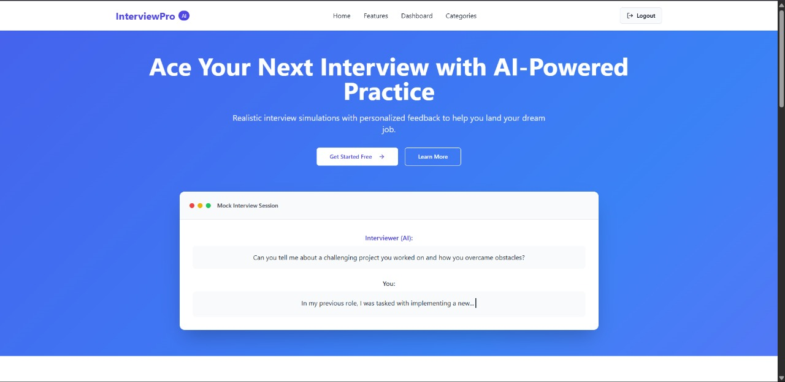
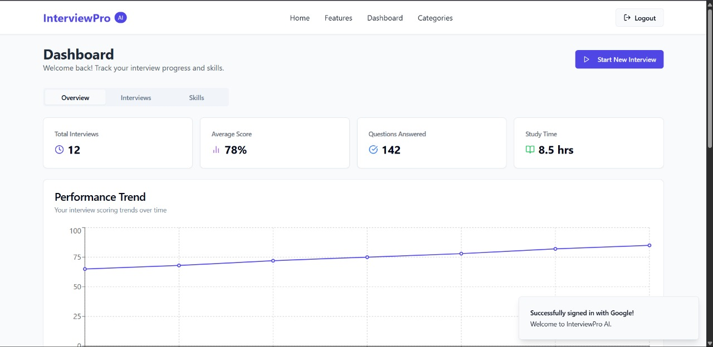
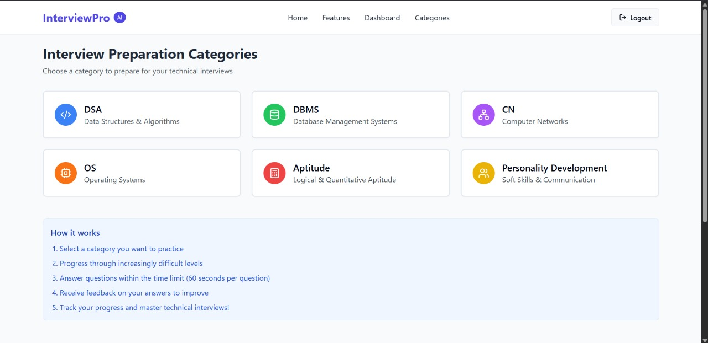

# AdaptivQ 🎯  
**AI-Powered Adaptive Mock Interview Platform**

AdaptivQ is an intelligent, adaptive quiz and mock interview platform designed to deliver personalized assessments in real-time. It leverages GenAI, RAG techniques, and machine learning to tailor questions based on a user’s performance, knowledge profile, and learning pace — making it perfect for students, educators, and ed-tech platforms.

---

## 🚀 Features

- 🎯 **Adaptive Questioning** – Dynamic adjustment of quiz difficulty based on user performance.
- 🧠 **Knowledge Profiling** – Tracks correctness, hesitation time, and confidence to estimate skill level.
- 🧾 **RAG-Based Interview Sessions** – Leveraging Gemini APIs with custom sheets and prompt templates for retrieval-augmented question generation and evaluation.
- 🧪 **GenAI Evaluation** – Answers are evaluated in real-time using Gemini’s LLM APIs for semantic understanding and scoring.
- 📈 **Performance Analytics** – Visualize improvement areas, mastery levels, and track real-time performance.
- 🔄 **Spaced Repetition System** – Reinforces learning using scientifically backed repetition schedules.
- 🎮 **Gamified Experience (Upcoming)** – Leaderboards, badges, adaptive timers for engagement.

---

## 🧩 Architecture Overview

- **Client Layer**: React.js + Tailwind + Material UI
- **Application Layer**: Node.js + Express API Gateway
- **ML Layer**: Python (TensorFlow, PyTorch) + Gemini API integration for GenAI
- **Scraping Engine**: Selenium + BeautifulSoup + Firecrawl for question curation
- **RAG Support**: Custom Gemini Prompt + Structured Google Sheet RAG layer
- **Background Tasks**: Celery + Redis workers for async model evaluation & feedback
- **Database**: PostgreSQL, Redis Cache, Firebase (Auth & File Storage)

---

## 🛠️ Tech Stack

| Layer         | Tools Used                                                       |
|--------------|-------------------------------------------------------------------|
| Frontend     | React, TypeScript, Tailwind CSS, Vite                             |
| Backend      | Node.js, Express.js, REST APIs                                    |
| ML & GenAI   | Python, TensorFlow, PyTorch, Gemini API, RAG Sheet Integration    |
| Scraping     | Selenium, BeautifulSoup, Playwright, Firecrawl                    |
| Auth & DB    | Firebase Auth, PostgreSQL, Redis                                  |
| Infra        | Docker, Vercel Hosting, GitHub Actions (CI/CD)                    |

---

## 📸 Screenshots

### 🔵 Home Page - AI-Powered Interview Practice

---

### 📊 Dashboard - Track Your Progress

---

### 📚 Categories - Choose Your Practice Domain

---

## ⚙️ How It Works

1. Select a category from the dashboard
2. Questions adapt based on your responses and time taken
3. GenAI evaluates your responses in real-time
4. Your performance is tracked and analyzed visually
5. Weak areas are reinforced with RAG-powered spaced repetition

---

## 💡 Upcoming

- Full voice-based interview simulation
- Peer leaderboard and group competitions
- Resume scoring and job-matching suggestions

---
